---
## Front matter
lang: ru-RU
title: Лабораторная работы №1
subtitle: Git
author:
  - Кузнецова С. В.
institute:
  - Российский университет дружбы народов, Москва, Россия
date: 20 февраля 2025

## i18n babel
babel-lang: russian
babel-otherlangs: english

## Formatting pdf
toc: false
toc-title: Содержание
slide_level: 2
aspectratio: 169
section-titles: true
theme: metropolis
header-includes:
 - \metroset{progressbar=frametitle,sectionpage=progressbar,numbering=fraction}
 - '\makeatletter'
 - '\beamer@ignorenonframefalse'
 - '\makeatother'
---

# Информация

## Докладчик

:::::::::::::: {.columns align=center}
::: {.column width="70%"}

  * Кузнецова София Вадимовна
  * Российский университет дружбы народов

:::
::: {.column width="30%"}

:::
::::::::::::::

# Ход работы

## Подготовка

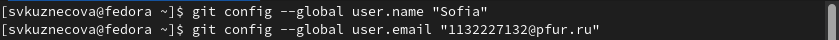{ #fig:001 width=65% }

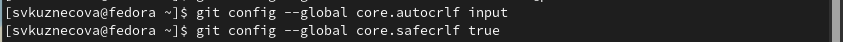{ #fig:002 width=65% }
    	   	
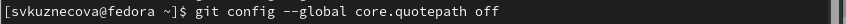{ #fig:003 width=65% }

## Создание проекта

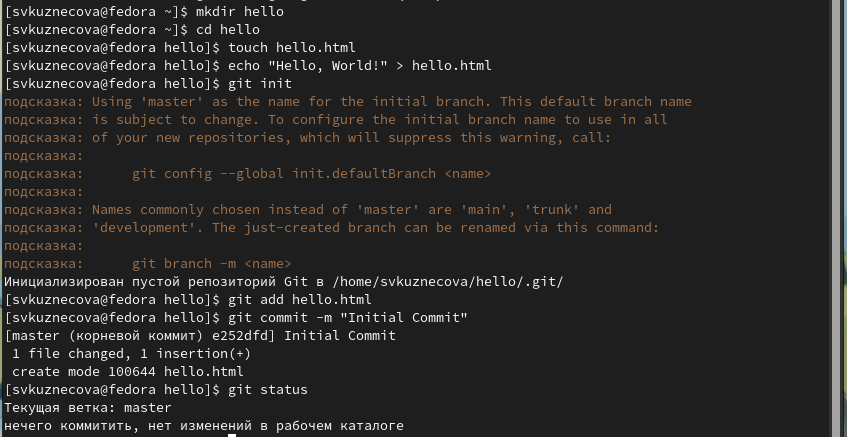{ #fig:004 width=80% }

## Внесение изменений

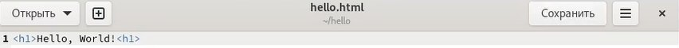{ #fig:005 width=60% }

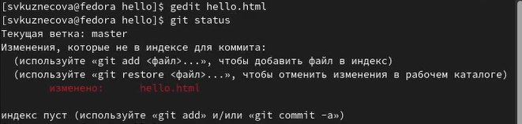{ #fig:006 width=60% }

## Коммит изменений

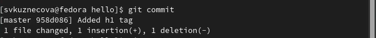{ #fig:007 width=40% }
	
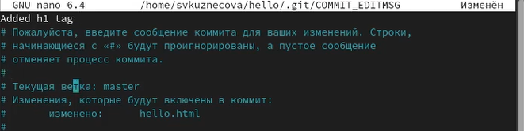{ #fig:008 width=40% }

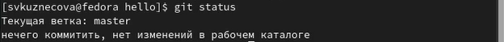{ #fig:09 width=40% }

## Добавление тегов

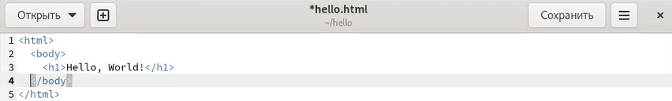{ #fig:010 width=40% }

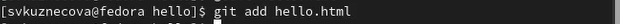{ #fig:011 width=40% }

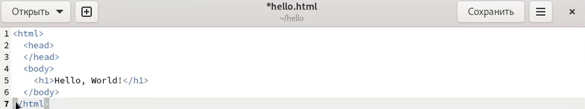{ #fig:012 width=40% }

## Коммит

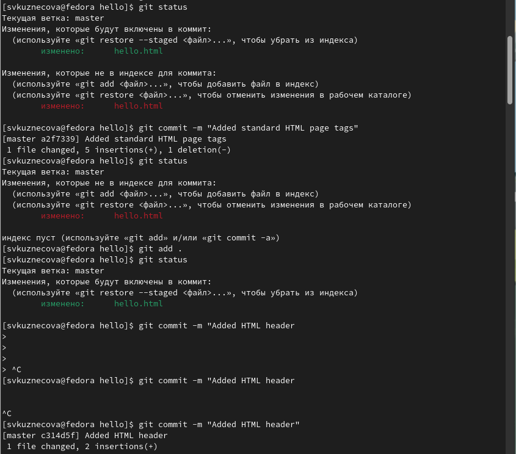{ #fig:013 width=55% }

## История

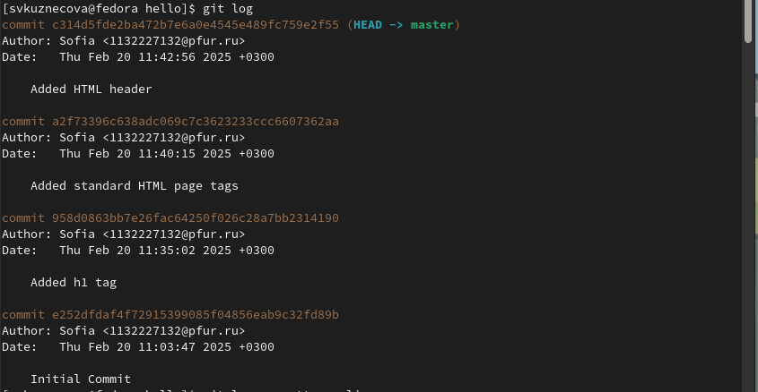{ #fig:014 width=30% }

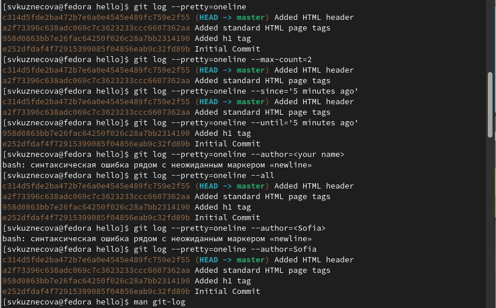{ #fig:015 width=30% }

## Получение старых версий

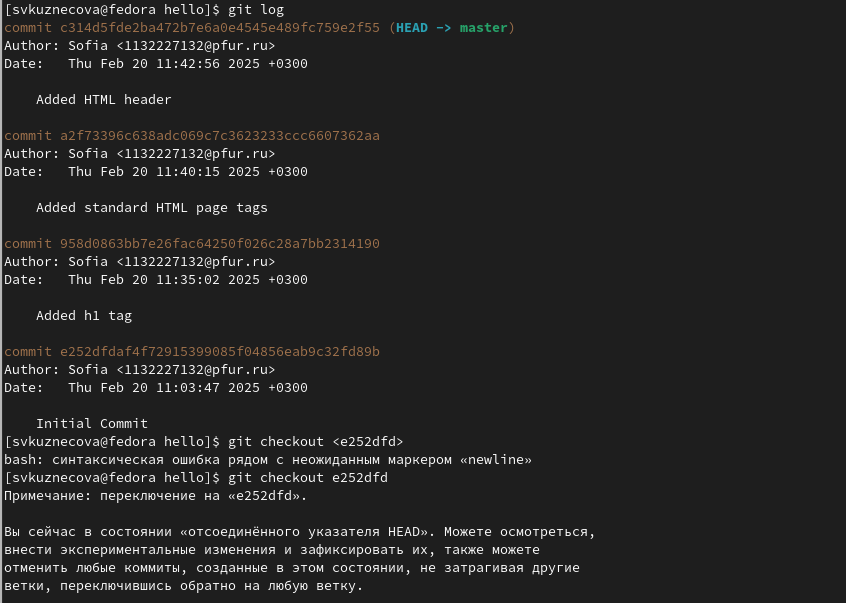{ #fig:016 width=30% }

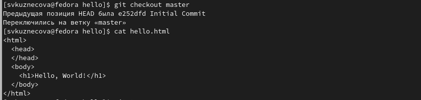{ #fig:017 width=30% }

## Cоздание тегов версий. Переключение по имени тега

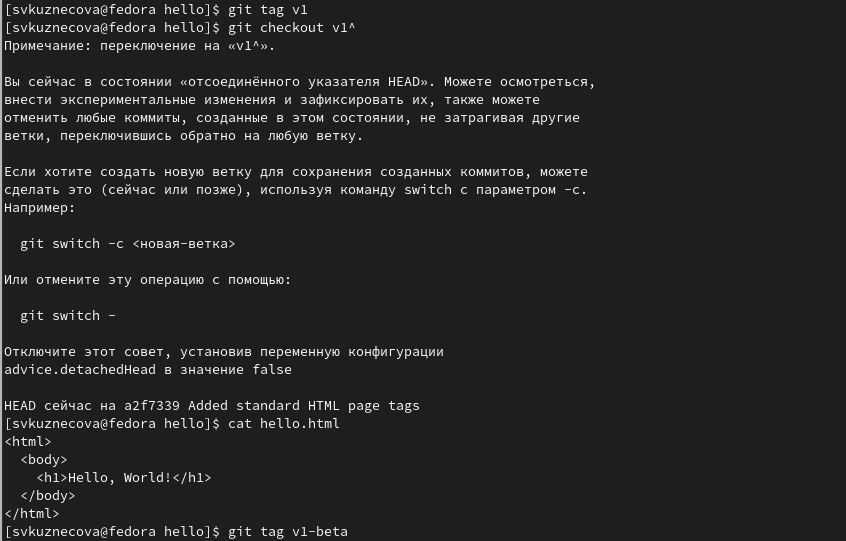{ #fig:018 width=30% }

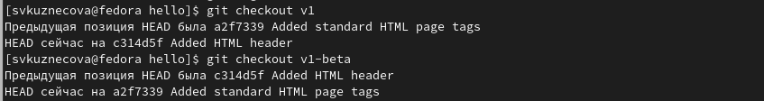{ #fig:019 width=30% }

## Просмотр тегов с помощью команды tag

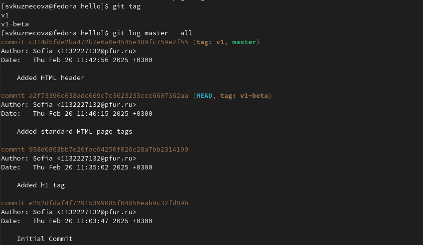{ #fig:020 width=80% }

## Отмена локальных изменений (до индексации)

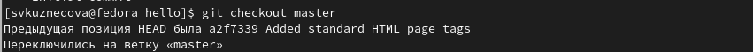{ #fig:021 width=20% }

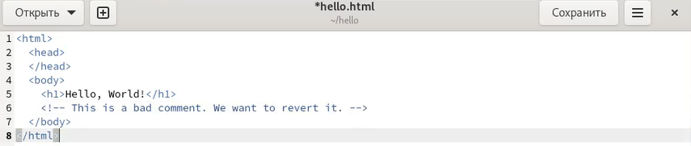{ #fig:022 width=20% }

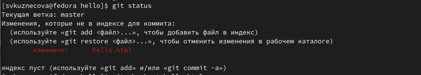{ #fig:023 width=20% }

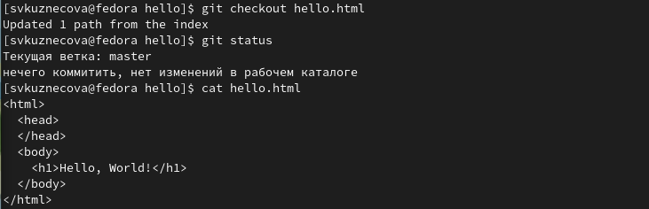{ #fig:024 width=20% }

## Отмена проиндексированных изменений (перед коммитом)

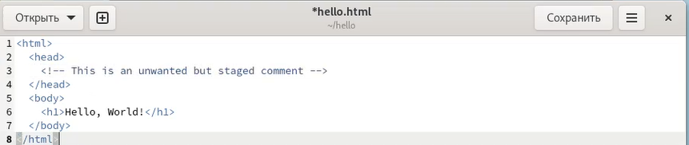{ #fig:025 width=50% }

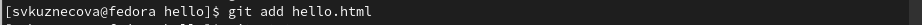{ #fig:026 width=50% }

## Отмена проиндексированных изменений (перед коммитом)

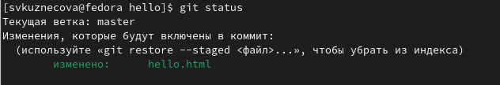{ #fig:027 width=40% }

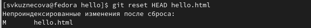{ #fig:028 width=40% }

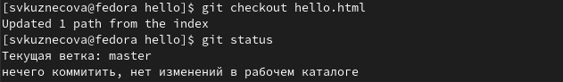{ #fig:029 width=40% }

## Отмена коммитов

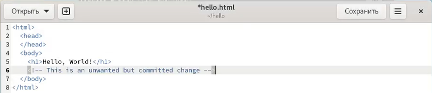{ #fig:030 width=50% }

{ #fig:031 width=50% }

## Отмена коммитов

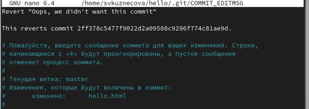{ #fig:032 width=30% }

{ #fig:033 width=30% }

## Удаление коммиттов из ветки

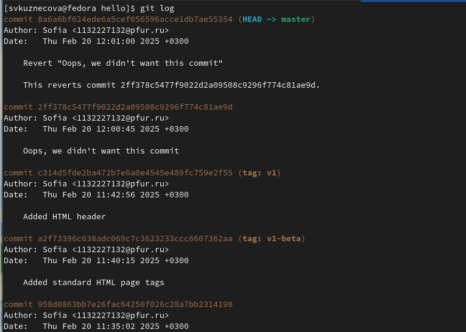{ #fig:034 width=50% }

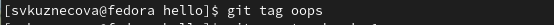{ #fig:035 width=50% }

## Удаление коммиттов из ветки

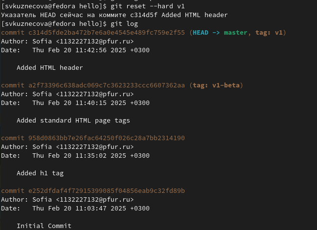{ #fig:036 width=25% }

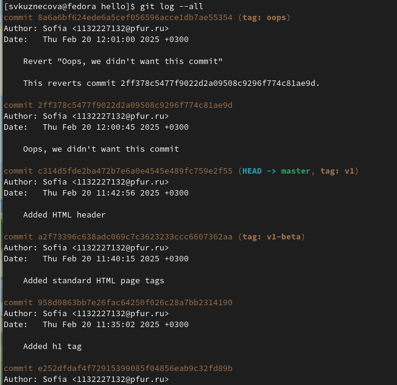{ #fig:037 width=20% }

## Удаление тега oops

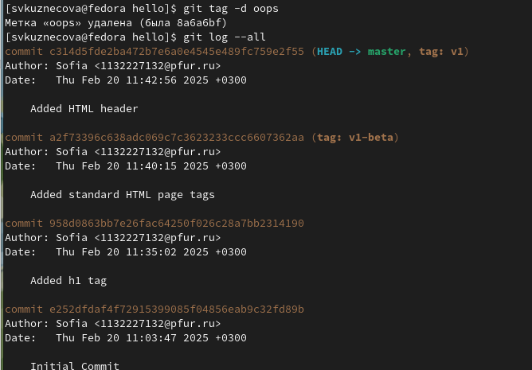{ #fig:038 width=50% }

## Внесение изменений в коммиты

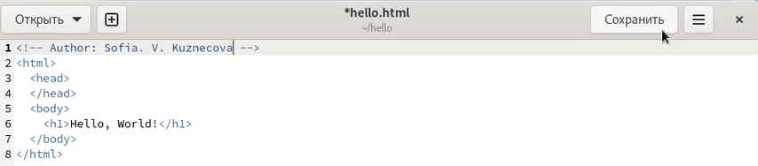{ #fig:039 width=50% }

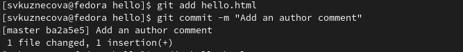{ #fig:040 width=50% }

## Внесение изменений в коммиты

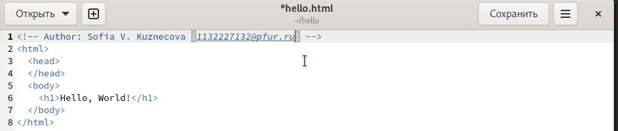{ #fig:041 width=30% }

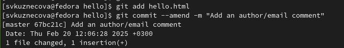{ #fig:042 width=35% }

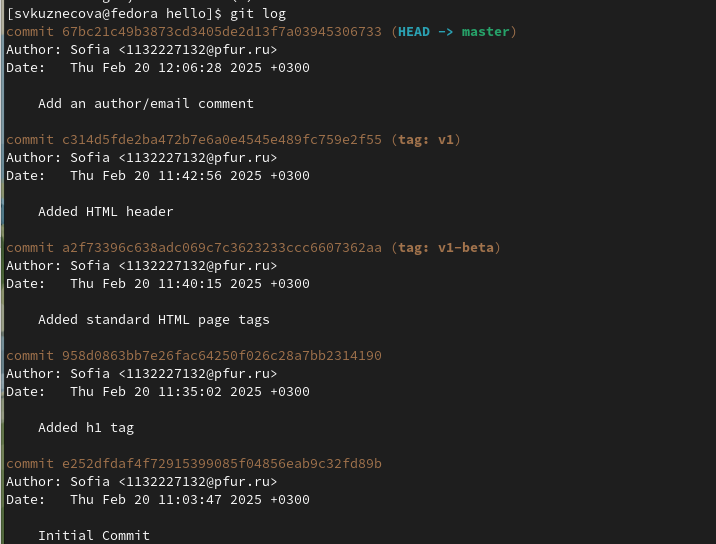{ #fig:043 width=20% }

## Перемещение файлов. Второй способ перемещения файлов

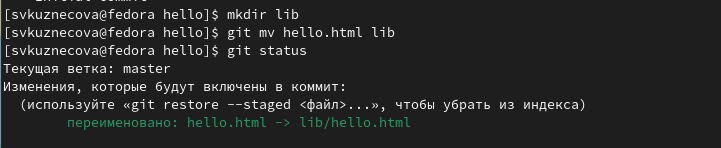{ #fig:044 width=40% }

{ #fig:045 width=40% }

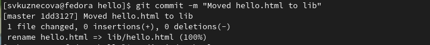{ #fig:046 width=40% }

## Подробнее о структуре

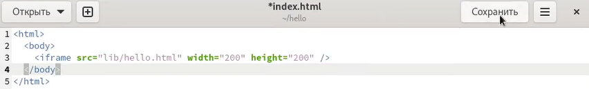{ #fig:047 width=60% }

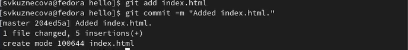{ #fig:048 width=60% }

## Git внутри: Каталог .git

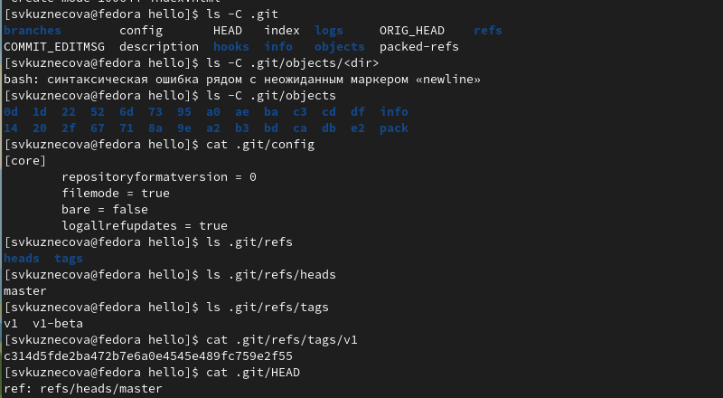{ #fig:049 width=80% }

## Работа непосредственно с объектами git

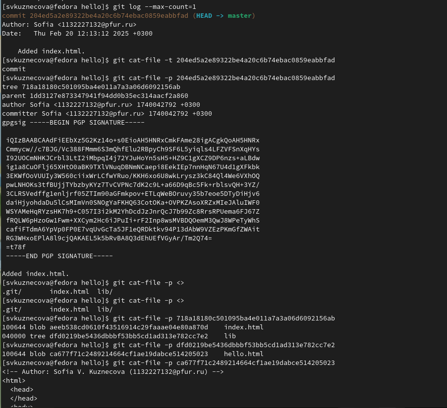{ #fig:050 width=50% }

## Создание ветки. Добавление файлы стилей style.css. Создание файла. 

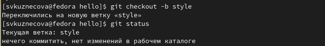{ #fig:051 width=30% }

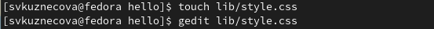{ #fig:052 width=30% }

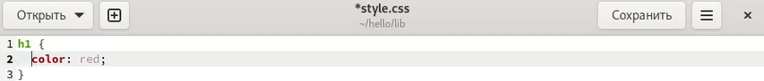{ #fig:053 width=30% }

{ #fig:054 width=30% }

## Обновление файла hello.html

{ #fig:055 width=25% }

{ #fig:056 width=25% }

{ #fig:057 width=25% }

{ #fig:058 width=25% }

## Навигация по веткам

{ #fig:059 width=15% }

{ #fig:060 width=15% }

{ #fig:061 width=15% }

## Изменения в ветке master

{ #fig:062 width=100% }

## Создаётся коммит изменений README.md в ветку master.

{ #fig:063 width=50% }

## Слияние

{ #fig:064 width=40% }

## Создание конфликта

{ #fig:065 width=50% }

{ #fig:066 width=50% }

## Создание конфликта

{ #fig:067 width=40% }

{ #fig:068 width=35% }

## Разрешение конфликтов

{ #fig:069 width=25% }

{ #fig:070 width=20% }

{ #fig:071 width=25% }

{ #fig:072 width=25% }

## Сброс ветки style

{ #fig:073 width=10% }

{ #fig:074 width=30% }

{ #fig:075 width=15% }

## Сброс ветки master

{ #fig:076 width=25% }

{ #fig:077 width=25% }

## Перебазирование

{ #fig:078 width=55% }

## Слияние в ветку master

{ #fig:079 width=45% }

## Клонирование репозиториев

{ #fig:080 width=85% }

## Просмотр клонированного репозитория

{ #fig:081 width=60% }

## Origin

{ #fig:082 width=85% }

## Удаленные ветки

{ #fig:083 width=90% }

## Изменение оригинального репозитория

{ #fig:084 width=40% }

{ #fig:085 width=40% }

{ #fig:086 width=40% }

## Изменение оригинального репозитория

{ #fig:087 width=35% }

{ #fig:088 width=35% }

## Слияние извлеченных изменений

{ #fig:089 width=40% }

{ #fig:090 width=40% }

## Добавление ветки наблюдения

{ #fig:091 width=100% }

## Создайте чистый репозиторий

{ #fig:092 width=100% }

## Добавление удаленного репозитория

{ #fig:093 width=50% }

{ #fig:094 width=50% }

## Извлечение общих изменений

{ #fig:095 width=95% }

# Выводы

В ходе выполнения лабораторной работы научилась работать с git.

## {.standout}

Спасибо за внимание!
