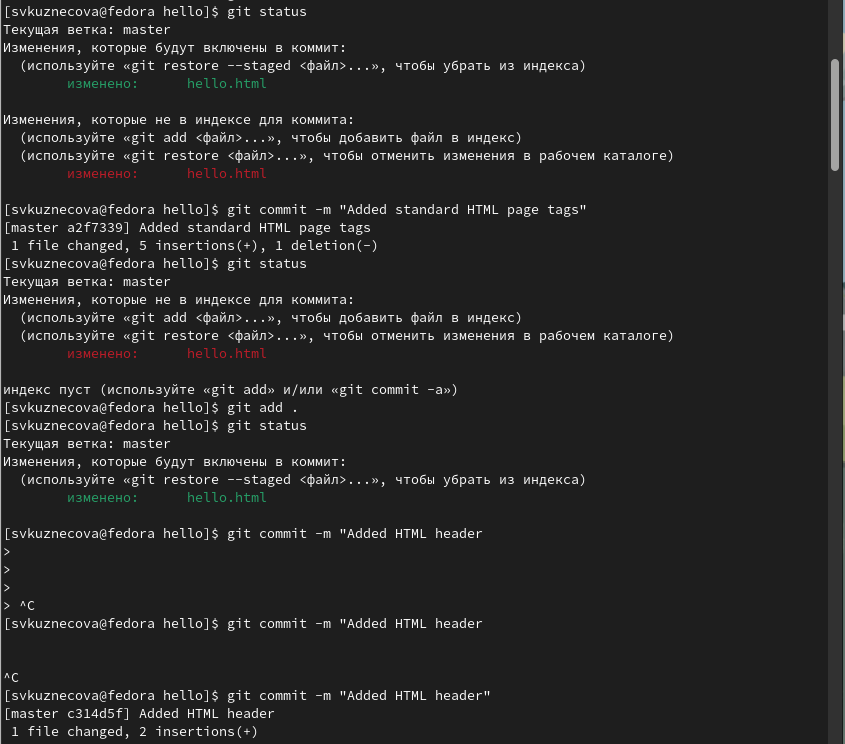
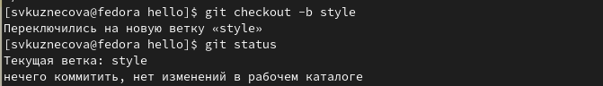
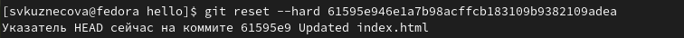
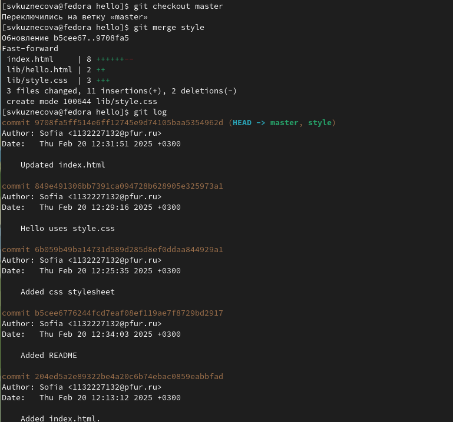

---
## Front matter
title: "Отчёт по лабораторной работе №1"
subtitle: "дисциплина: Математическое моделирование"
author: "Студент: Кузнецова София Вадимовна"

## Generic otions
lang: ru-RU
toc-title: "Содержание"

## Bibliography
bibliography: bib/cite.bib
csl: pandoc/csl/gost-r-7-0-5-2008-numeric.csl

## Pdf output format
toc: true # Table of contents
toc-depth: 2
lof: true # List of figures
lot: true # List of tables
fontsize: 12pt
linestretch: 1.5
papersize: a4
documentclass: scrreprt
## I18n polyglossia
polyglossia-lang:
  name: russian
  options:
	- spelling=modern
	- babelshorthands=true
polyglossia-otherlangs:
  name: english
## I18n babel
babel-lang: russian
babel-otherlangs: english
## Fonts
mainfont: PT Serif
romanfont: PT Serif
sansfont: PT Sans
monofont: PT Mono
mainfontoptions: Ligatures=TeX
romanfontoptions: Ligatures=TeX
sansfontoptions: Ligatures=TeX,Scale=MatchLowercase
monofontoptions: Scale=MatchLowercase,Scale=0.9
## Biblatex
biblatex: true
biblio-style: "gost-numeric"
biblatexoptions:
  - parentracker=true
  - backend=biber
  - hyperref=auto
  - language=auto
  - autolang=other*
  - citestyle=gost-numeric
## Pandoc-crossref LaTeX customization
figureTitle: "Рис."
tableTitle: "Таблица"
listingTitle: "Листинг"
lofTitle: "Список иллюстраций"
lolTitle: "Листинги"
## Misc options
indent: true
header-includes:
  - \usepackage{indentfirst}
  - \usepackage{float} # keep figures where there are in the text
  - \floatplacement{figure}{H} # keep figures where there are in the text
---

# Цель работы

Научиться работать с git.

# Выполнение лабораторной работы

Выполним следующие команды, чтобы git узнал наше имя и электронную почту.Настроим core.autocrlf с параметрами true и input (делает все переводы строк текстовых файлов в главном репозитории одинаковы). Что бы избежать нечитаемых строк, установим соответствующий флаг.

{ #fig:001 width=100% }

{ #fig:002 width=100% }
    	   	
{ #fig:003 width=100% }

Начнём работу в пустом рабочем каталоге с создания пустого каталога с именем hello, затем войдём в него и создадим там файл с именем hello.html. Чтобы создать git репозиторий из этого каталога, выполним команду git init. Добавим файл в репозиторий и используем команду git status, чтобы проверить текущее состояние репозитория.

{ #fig:004 width=100% }

Добавим кое-какие HTML-теги к нашему приветствию. Изменим содержимое файла hello.html. Проверим состояние рабочего каталога.

{ #fig:005 width=100% }

{ #fig:006 width=100% }

Сделаем коммит и проверим состояние. Открылся редактор. В первой строке введём комментарий: «Added h1 tag». Сохраним файл и выйдем из редактора. Теперь еще раз проверим состояние.

{ #fig:007 width=100% }
	
{ #fig:008 width=100% }

{ #fig:09 width=100% }

Изменим страницу «Hello, World», чтобы она содержала стандартные теги <html> и <body>. Теперь добавим это изменение в индекс git. Теперь добавим заголовки HTML (секцию <head>) к странице «Hello, World»

{ #fig:010 width=100% }

{ #fig:011 width=100% }

{ #fig:012 width=100% }

Проверим текущий статус. Произведём коммит проиндексированного изменения (значение по умолчанию), а затем еще раз проверим состояние. Теперь добавим второе изменение в индекс, а затем проверим состояние с помощью команды git status. Второе изменение было проиндексировано и готово к коммиту. Сделаем коммит второго изменения.

{ #fig:013 width=100% }

Получим список произведенных изменений. Посмотрим однострочный формат истории. Также посмотрим много вариантов отображения лога и справочную страницу.

{ #fig:014 width=100% }

{ #fig:015 width=100% }

Получим хэши предыдущих версий. Изучим данные лога и найдём хэш для первого коммита. Используем этот хэш-код в команде ниже. Затем проверим содержимое файла hello.html. Вернёмся к последней версии в ветке master.

{ #fig:016 width=100% }

{ #fig:017 width=100% }

Назовем текущую версию страницы hello первой (v1). Создадим тег первой версии. Для предыдущих версий создадим тег для версии, которая идет перед текущей версией и назовем его v1-beta. В первую очередь переключимся на предыдущую версию. Это версия c тегами html и body, но еще пока без head. Теперь сделаем ее версией v1-beta. Теперь попробуем попереключаться между двумя отмеченными версиями.

{ #fig:018 width=100% }

{ #fig:019 width=100% }

Посмотрим, какие теги доступны, используя команду git tag. Также посмотрим теги в логе.

{ #fig:020 width=100% }

Убедимся, что мы находитесь на последнем коммите ветки master, прежде чем продолжить работу. Внесём изменение в файл hello.html в виде нежелательного комментария. Проверим состояние рабочего каталога. Используем команду git checkout для переключения версии файла hello.html в репозитории.

{ #fig:021 width=100% }

{ #fig:022 width=100% }

{ #fig:023 width=100% }

{ #fig:024 width=100% }

Внесём изменения в файл hello.html в виде нежелательного комментария. Проиндексируем это изменение. Проверим состояние нежелательного изменения. Переключимся на версию коммита. Переключимся на версию коммита и проверим статус.

{ #fig:025 width=100% }

{ #fig:026 width=100% }

{ #fig:027 width=100% }

{ #fig:028 width=100% }

{ #fig:029 width=100% }

Изменим файл hello.html на следующий. Выполняем следующие команды.Отменим коммит. Проверим лога для просмотра нежелательные и отмененные коммиты в наш репозиторий.

{ #fig:030 width=100% }

{ #fig:031 width=100% }

{ #fig:032 width=100% }

{ #fig:033 width=100% }

Сделаем быструю проверку истории коммитов. Отметим последний коммит тегом, чтобы потом можно было его найти. 
Глядя на историю лога, мы видим, что коммит с тегом «v1» является коммитом, предшествующим ошибочному коммиту. Сбросим ветку до этой точки.Посмотрим на все коммиты.

{ #fig:034 width=100% }

{ #fig:035 width=100% }

{ #fig:036 width=100% }

{ #fig:037 width=100% }

Тег oops свою функцию выполнил. Удалим его и коммиты, на которые он ссылался, сборщиком мусора.

{ #fig:038 width=100% }

Добавим в страницу комментарий автора (вставьте свою фамилию). Сделаем коммит. Обновим страницу hello, включив в неё email. Изменим предыдущий коммит, включив в него адрес электронной почты. Сделаем быструю проверку нашей истории коммитов.

{ #fig:039 width=100% }

{ #fig:040 width=100% }

{ #fig:041 width=100% }

{ #fig:042 width=100% }

{ #fig:043 width=100% }

Создадим структуру репозитория. И перенесем страницу в каталог lib. Следующий набор команд идентичен последним действиям. Работы здесь побольше, но результат тот же. Сделаем коммит этого перемещения.

{ #fig:044 width=100% }

{ #fig:045 width=100% }

{ #fig:046 width=100% }

Добавим файл index.html в наш репозиторий. Сделаем коммит.

{ #fig:047 width=100% }

{ #fig:048 width=100% }

Посмотрим каталог в котором хранится вся информация git. Увидим набор каталогов, имена которых состоят из 2 символов. Посмотрим в один из каталогов с именем из 2 букв. Также посмотрим файл конфигурации, создающийся для каждого конкретного проекта. Увидим файл HEAD, который содержит ссылку на текущую ветку, в данный момент это должна быть ветка master.

{ #fig:049 width=100% }

Посмотрим последний коммит в репозиторий. Выведем последний коммит. Выведем дерево каталогов, ссылка на который идет в коммите. Выведем каталог lib. Выведем файл hello.html.

{ #fig:050 width=100% }

Назовем новую ветку «style». Добавим файл стилей style.css. Создадим файл. Сделаем коммит.

{ #fig:051 width=100% }

{ #fig:052 width=100% }

{ #fig:053 width=100% }

{ #fig:054 width=100% }

Обновим файл hello.html, чтобы использовать стили style.css. Сделаем крммит. Обновим файл index.html, чтобы он тоже использовал style.css. Сделаем коммит.

{ #fig:055 width=100% }

{ #fig:056 width=100% }

{ #fig:057 width=100% }

{ #fig:058 width=100% }

Просмотрим проект, который теперь имеет две ветки. Используем команду git checkout для переключения между ветками. Вернемся к ветке style. 

{ #fig:059 width=100% }

{ #fig:060 width=100% }

{ #fig:061 width=100% }

Создадим файла README в ветке master. Сделаем коммит изменений README.md в ветку master.

{ #fig:062 width=100% }

Сделаем коммит. Просмотрим текущие ветки.

{ #fig:063 width=100% }

Вернемся к ветке style и сольем master с style.

{ #fig:064 width=100% }

Вернёмся в ветку master и внесём следующие изменения. Сделаем коммит. Просмотрим ветки.

{ #fig:065 width=100% }

{ #fig:066 width=100% }

{ #fig:067 width=10щ% }

{ #fig:068 width=100% }

Теперь вернемся к ветке style и попытаемся объединить ее с новой веткой master. Откроем файл lib/hello.html и увидим. Вручную разрешим конфликт. Внесём изменения в lib/hello.html для достижения результата. Сделаем коммит.

{ #fig:069 width=100% }

{ #fig:070 width=100% }

{ #fig:071 width=100% }

{ #fig:072 width=100% }

Находим последний коммит перед слиянием. Видим, что коммит «Updated index.html» был последним на ветке style
перед слиянием. Поэтому сбросим ветку style к этому коммиту. Ищем лог ветки style. У нас в истории больше нет коммитов слияний.

{ #fig:073 width=100% }

{ #fig:074 width=100% }

{ #fig:075 width=100% }

Добавив интерактивный режим в ветку master, мы внесли изменения, конфликтующие с изменениями в ветке style. Вернемся в ветке master в точку перед внесением конфликтующих изменений. Коммит «Added README» идет непосредственно перед коммитом конфликтующего интерактивного режима. Сбрасываем ветку master к коммиту «Added README».

{ #fig:076 width=100% }

{ #fig:077 width=100% }

Используем команду rebase вместо команды merge. Вернувшись в точку до первого слияния хотим перенести изменения из ветки master в нашу ветку style. На этот раз для переноса изменений из ветки master используем команду git rebase вместо слияния.

{ #fig:078 width=100% }

Сольём style в master. Просмотрим логи.

{ #fig:079 width=100% }

Перейдём в рабочий каталог и создадим клон репозитория hello.

{ #fig:080 width=100% }

Взглянем на клонированный репозиторий и увидим список всех файлов на верхнем уровне оригинального репозитория README.md, index.html и lib. Просмотрим историю репозитория.

{ #fig:081 width=100% }

Мы видим, что клонированный репозиторий знает об имени по умолчанию удаленного репозитория. Посмотрим, можем ли мы получить более подробную информацию об имени по умолчанию(можем).

{ #fig:082 width=100% }

Посмотрим на ветки, доступные в нашем клонированном репозитории. Мы видим, в списке только ветка master. Команда git
branch выводит только список локальных веток по умолчанию. Git выводит все коммиты в оригинальный репозиторий, но ветки в удаленном репозитории не рассматриваются как локальные. 

{ #fig:083 width=100% }

Войдём в репозиторий hello. Внесём изменения в файл README.md. Добавим это изменение и сделайте коммит. Извлечём изменения из удаленного репозитория. Проверим файл README.md и удостоверимся, что он не изменился.

{ #fig:084 width=100% }

{ #fig:085 width=100% }

{ #fig:086 width=100% }

{ #fig:087 width=100% }

{ #fig:088 width=100% }

Ещё раз проверим файл README.md и видим изменения. Теперь давайте рассмотрим объединение fetch и merge в одну команду, эквивалентно двум следующим шагам. Добавим локальную ветку, которая отслеживает удаленную ветку. Теперь мы можем видеть ветку style в списке веток и логе.

{ #fig:089 width=100% }

{ #fig:090 width=100% }

Создаём чистый репозиторий.

{ #fig:091 width=100% }

Добавим репозиторий hello.git к нашему оригинальному репозиторию.

{ #fig:092 width=100% }

Так как чистые репозитории, как правило, расшариваются на каком-нибудь сетевом сервере, нам необходимо отправить наши изменения в другие репозитории. Начнем с создания изменения для отправки. Отредактируйте файл README.md и
сделайте коммит. Теперь отправьте изменения в общий репозиторий.

{ #fig:093 width=100% }

{ #fig:094 width=100% }

Извлечём изменения из общего репозитория. Быстро переключимся в клонированный репозиторий и извлечём изменения, только что отправленные в общий репозиторий.

{ #fig:095 width=100% }

# Выводы

В ходе выполнения лабораторной работы научилась работать с git.
