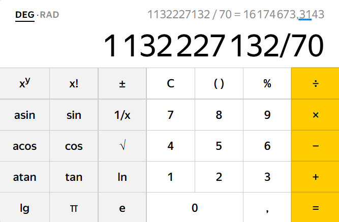
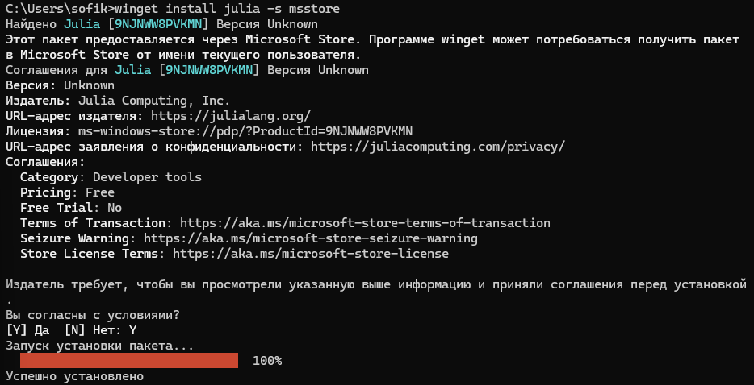
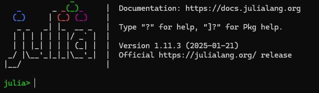
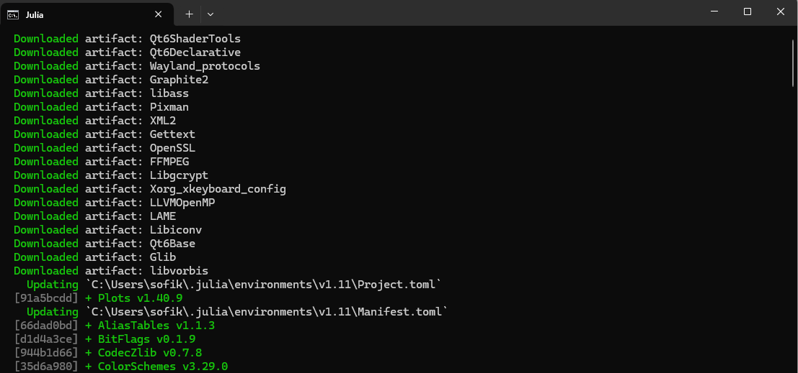
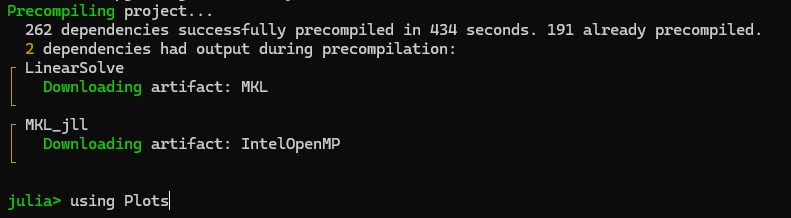
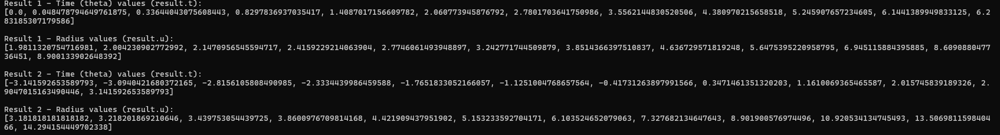
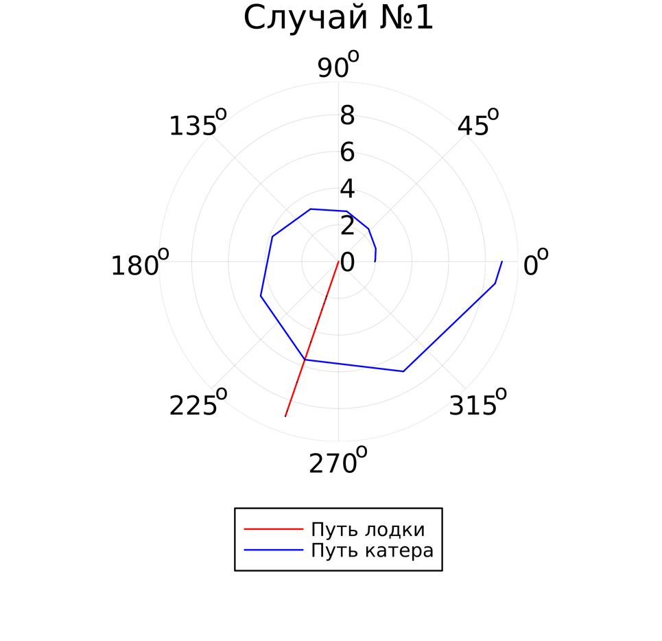
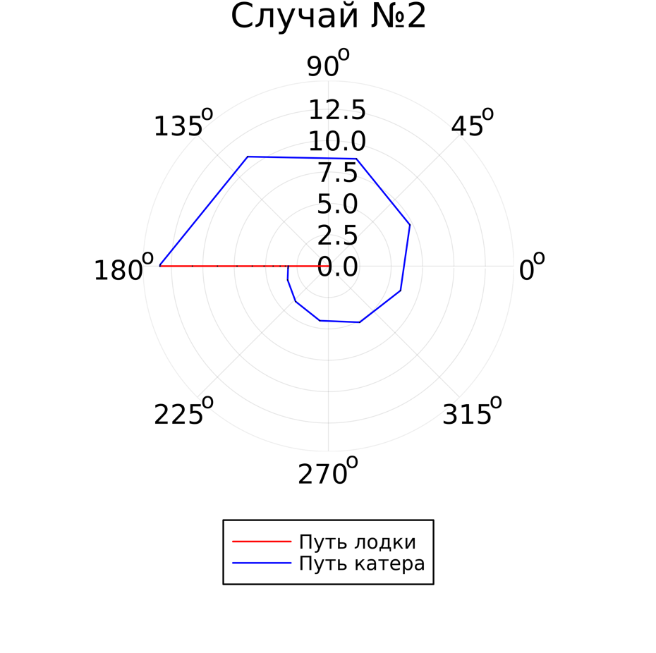

---
## Front matter
title: "Отчет по лабораторной работе №2"
subtitle: "Задача о погоне"
author: "Кузнецова София Вадимовна"

## Generic otions
lang: ru-RU
toc-title: "Содержание"

## Bibliography
bibliography: bib/cite.bib
csl: pandoc/csl/gost-r-7-0-5-2008-numeric.csl

## Pdf output format
toc: true # Table of contents
toc-depth: 2
lof: true # List of figures
lot: true # List of tables
fontsize: 12pt
linestretch: 1.5
papersize: a4
documentclass: scrreprt
## I18n polyglossia
polyglossia-lang:
  name: russian
  options:
	- spelling=modern
	- babelshorthands=true
polyglossia-otherlangs:
  name: english
## I18n babel
babel-lang: russian
babel-otherlangs: english
## Fonts
mainfont: IBM Plex Serif
romanfont: IBM Plex Serif
sansfont: IBM Plex Sans
monofont: IBM Plex Mono
mathfont: STIX Two Math
mainfontoptions: Ligatures=Common,Ligatures=TeX,Scale=0.94
romanfontoptions: Ligatures=Common,Ligatures=TeX,Scale=0.94
sansfontoptions: Ligatures=Common,Ligatures=TeX,Scale=MatchLowercase,Scale=0.94
monofontoptions: Scale=MatchLowercase,Scale=0.94,FakeStretch=0.9
mathfontoptions:
## Biblatex
biblatex: true
biblio-style: "gost-numeric"
biblatexoptions:
  - parentracker=true
  - backend=biber
  - hyperref=auto
  - language=auto
  - autolang=other*
  - citestyle=gost-numeric
## Pandoc-crossref LaTeX customization
figureTitle: "Рис."
tableTitle: "Таблица"
listingTitle: "Листинг"
lofTitle: "Список иллюстраций"
lotTitle: "Список таблиц"
lolTitle: "Листинги"
## Misc options
indent: true
header-includes:
  - \usepackage{indentfirst}
  - \usepackage{float} # keep figures where there are in the text
  - \floatplacement{figure}{H} # keep figures where there are in the text
---

# Выполнение лабораторной работы

# Цель работы

Решить задачу о погоне и изучить основы языка программирования Julia.

# Задание

1. Запишите уравнение, описывающее движение катера, с начальными условиями для двух случаев (в зависимости от расположения катера относительно лодки в начальный момент времени). 
2. Постройте траекторию движения катера и лодки для двух случаев. 
3. Найдите точку пересечения траектории катера и лодки.

# Выполнение лабораторной работы

Расчитаем свой вариант по формуле и получаем наш вариант №59.

{ #fig:001 width=70% }

1. На море в тумане катер береговой охраны преследует лодку браконьеров. Через определенный промежуток времени туман рассеивается, и лодка обнаруживается на расстоянии 20,3 км от катера. Затем лодка снова скрывается в тумане и уходит прямолинейно в неизвестном направлении. Известно, что скорость катера в 5,2 раза больше скорости браконьерской лодки. 

2. Примем за момент отсчета времени момент первого рассеивания тумана. Введем полярные координаты с центром в точке нахождения браконьеров и осью, проходящей через катер береговой охраны. Тогда начальные координаты катера (20,3; 0). Обозначим скорость лодки v.

3. Траектория катера должна быть такой, чтобы и катер, и лодка все время были на одном расстоянии от полюса. Только в этом случае траектория катера пересечется с траекторией лодки. Поэтому для начала катер береговой охраны должен двигаться некоторое время прямолинейно, пока не окажется на том же расстоянии от полюса, что и лодка браконьеров. После этого катер береговой охраны должен двигаться вокруг полюса удаляясь от него с той же скоростью, что и лодка браконьеров.

4. Пусть время t -  время, через которое катер и лодка окажутся на одном расстоянии от начальной точки. 
$$ t = {{x }\over{v}} $$
$$ t = {{20,3-x}\over{5,2 v}} $$
$$ t = {{20,3+x}\over{5,2 v}} $$

Из этих уравнений получаем объедиение двух уравнений:

$$ \left[ \begin{array}{cl}
{{x}\over{v}} = {{20,3-x}\over{5,2 v}}\\
{{x}\over{v}} = {{20,3+x}\over{5,2 v}}
\end{array} \right. $$

Решая это, получаем два значения для x:
$$ x1 = {{3,27419355}} $$
$$ x2 = {{4,83333333}} $$

$$ v_\tau  $$ – тангенциальная скорость
$$ v $$ – радиальная скорость
$$ v = {dr\over dt} $$
$$ v_\tau = {{\sqrt{((5,2*v)^2-v^2)}}} = {\sqrt{651}*v \over{5}}   $$

$$ \left\{ \begin{array}{cl}
{dr\over dt} = v \\
r{d\theta\over dt} = {\sqrt{651}*v \over{5}} 
\end{array} \right. $$

$$ \left\{ \begin{array}{cl}
\theta_0 = 0 \\
r_0 = x_1 = {{3,27419355}}
\end{array} \right. $$

или

$$ \left\{ \begin{array}{cl}
\theta_0 = -\pi \\
r_0 = x_2 = {{4,83333333}}
\end{array} \right. $$

Итоговое уравнение после того, как убрали производную по t:

$$ {dr\over d\theta} = {5r\over\sqrt{651}} $$

# Моделирование с помощью Julia

1. Скачиваем Julia.

{ #fig:002 width=70% }

2. Запускаем Julia.

{ #fig:003 width=70% }

3. Скачиваем необходимые для работы пакеты.

{ #fig:004 width=70% }

{ #fig:005 width=70% }

4. Код для файла lab2.jl:

import Pkg
Pkg.add("Plots")
Pkg.add("DifferentialEquations")

using Plots
using DifferentialEquations

const a = 10.5
const n = 4.3
const r0 = a / (n + 1)
const r0_2 = a / (n - 1)
const T = (0, 2 * pi)
const T_2 = (-pi, pi)

function F(u, p, t)
    return u / sqrt(n * n - 1)
end

function F2(u, p, t) # Function for converging spiral
    damping = 0.01  # Adjust this value to control the damping strength
    return (u / sqrt(n * n - 1)) - damping * u # Apply dampening to radius
end

problem = ODEProblem(F, r0, T)
result = solve(problem, abstol=1e-8, reltol=1e-8)

dxR = rand(1:size(result.t)[1])
rAngels = [result.t[dxR] for i in 1:size(result.t)[1]]

plt = plot(proj=:polar, aspect_ratio=:equal, dpi=1000, legend=true, bg=:white)
plot!(plt, xlabel="theta", ylabel="r(t)", title="Случай №1", legend=:outerbottom)
plot!(plt, [rAngels[1], rAngels[2]], [0.0, result.u[end]], label="Путь лодки", color=:red, lw=1)
scatter!(plt, rAngels, result.u, label="", mc=:blue, ms=0.0005)
plot!(plt, result.t, result.u, xlabel="theta", ylabel="r(t)", label="Путь катера", color=:blue, lw=1)
scatter!(plt, result.t, result.u, label="", mc=:green, ms=0.0005)

savefig(plt, "lab2_01.png")

problem = ODEProblem(F2, r0_2, T_2)
result = solve(problem, abstol=1e-8, reltol=1e-8)

dxR = rand(1:size(result.t)[1])
rAngels = [result.t[dxR] for i in 1:size(result.t)[1]]

plt1 = plot(proj=:polar, aspect_ratio=:equal, dpi=1000, legend=true, bg=:white)
plot!(plt1, xlabel="theta", ylabel="r(t)", title="Случай №2", legend=:outerbottom)
plot!(plt1, [rAngels[1], rAngels[2]], [0.0, result.u[end]], label="Путь лодки", color=:red, lw=1)
scatter!(plt1, rAngels, result.u, label="", mc=:blue, ms=0.0005)
plot!(plt1, result.t, result.u, xlabel="theta", ylabel="r(t)", label="Путь катера", color=:blue, lw=1)
scatter!(plt1, result.t, result.u, label="", mc=:green, ms=0.0005)

savefig(plt1, "lab2_02.png")

6. Запускаем код.

{ #fig:006 width=70% }

7. Просмотр результата работы.

{ #fig:007 width=70% }

{ #fig:008 width=70% }

# Выводы

Были изучены основы языка программирования Julia и его библиотеки, которые используются для построения графиков и решения дифференциальных уравнений. А также решили задачу о погоне.

# Список литературы 

[1] Документация по Julia: https://docs.julialang.org/en/v1/

[2] Решение дифференциальных уравнений: https://www.wolframalpha.com/

